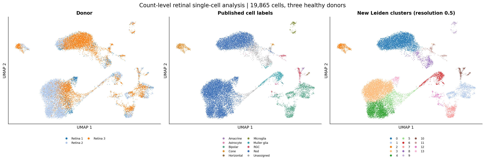

# Glaucoma genetic evidence and retinal cell context

**An executed genetic-evidence and retinal cell-context pilot with donor-aware RNA and regulatory extensions.**

Which glaucoma gene nominations remain supported under stricter evidence rules, and what retinal cell context do they show? This project integrates published primary open-angle glaucoma (POAG) GWAS–e/sQTL colocalization results with cluster-average expression from an independent healthy-human retinal single-cell atlas. The completed extension also processes retinal UMI counts, computes QC, PCA/Leiden/UMAP and marker audits, and examines candidate expression across donors. It demonstrates statistical bioinformatics, transparent evidence handling and reproducible Python analysis.

**[Read the completed report](results/figures_2f57d7230cde6290_attempt2/SUMMARY.md)** · **[Inspect the gene evidence table](results/analysis_173e90345ea951f1/tables/gene_evidence_and_retinal_context.csv)** · **[Inspect source and output checksums](results/analysis_173e90345ea951f1/analysis_manifest.json)**

## Completed targeted Bayesian colocalisation extension

**[Colocalisation methods and limitations](genetics_extension/README.md)** · **[PDF report](genetics_extension/published/report_08eb9809466be5fb/Glaucoma_coloc_pilot_report.pdf)** · **[Results workbook](genetics_extension/published/report_08eb9809466be5fb/Coloc_results_and_QC.xlsx)**

A separately executed targeted Python approximate-Bayes-factor colocalisation analysis uses regional GWAS and bulk-retina eQTL summary statistics to compare **NPC2, LTBP2 and YLPM1**. Six gene–GWAS comparisons and **216 prespecified sensitivity settings** were completed. In the European GWAS the respective PP.H4 values are **0.631, 0.760 and 0.000358**. LTBP2 reaches **0.809** in the combined-ancestry analysis, which overlaps the European study and is not an independent replication. None is robust above 0.80 across all sensitivity settings. These findings do not demonstrate gene causality or a cell-type-specific eQTL mechanism.

The extension reconstructs eQTL standard errors from rounded statistics and assumes a single causal variant per region, with results sensitive to priors and incomplete SNP overlap. **MR and SuSiE-coloc were not run.** The original V1 module continues to report previously published colocalisation nominations; it is not a newly fitted analysis.

## Completed V2: cross-study RNA and regulatory triangulation

**[V2 report](single_cell_v2/published/REPORT.md)** · **[V2 PDF](single_cell_v2/published/Glaucoma_V2_Report.pdf)** · **[228-gene evidence matrix](single_cell_v2/published/tables/candidate_evidence_matrix.csv)** · **[V2 code and methods](single_cell_v2/README.md)**

The executed Python extension expands all **228 nominations**, performs **2,400 technical resampling draws**, and compares **19,865 whole-cell profiles from three donors** with **51,645 nuclear profiles from four donors** in a separate published study. In five fixed cell types, **78/139 jointly evaluable genes** retain the same top RNA context. Six predefined metabolic programs are assessed with identical shared panel/control genes; three retain the same relative top type across studies.


NPC2's RNA context is sampling-stable and concordant across studies. Its index variant overlaps a microglia ATAC peak, while published gene links remain ambiguous: retinal eQTL annotations include NPC2/LTBP2 and HiChIP points to YLPM1. The evidence matrix preserves competing links, negative predictions, sparse genes and missing symbols. The original retinal eQTL resources overlap across publications and are not counted as independent genetic replications. This V2 RNA/regulatory module does not itself fit colocalisation, MR, or disease effects; targeted newly fitted ABF colocalisation results are reported separately in `genetics_extension/`. No causal target is established.

## Completed count-level single-cell extension

**[Single-cell report](single_cell/published/REPORT.md)** · **[PDF report](single_cell/published/Glaucoma_Single_Cell_Pilot_Report.pdf)** · **[Code and reproducibility](single_cell/README.md)** · **[Donor robustness table](single_cell/published/tables/robustness_summary.csv)**

The new module uses the original filtered UMI matrix from the same healthy-retina atlas: **20,009 cells, 21,989 genes, three donors and five libraries**. QC retains **19,865 cells**. Normalisation, library-aware feature selection, 30 PCs, Leiden clustering, UMAP and canonical-marker audits have been executed, with five additional figures and nine focused tests passed locally.



Six nominated genes are summarised with donor/type pseudobulks and equal donor weighting. Five cell types have at least 20 cells in every donor. Among those types, **DGKG, NPC2 and SLC2A12** retain Muller glia as their highest expression context in all three leave-one-donor-out reaggregations. Five of six retain their highest context under stricter QC; COL8A2 is too sparse for that comparison. Small groups and alternative minimum-cell sensitivities are reported explicitly.

This is descriptive analysis of three healthy donors. Published labels remain primary; the new clusters receive a provisional marker audit. Leave-one-donor-out reaggregates saved pseudobulks without refitting clusters. No disease/age effect, spatial mapping, or therapeutic validation is claimed for this single-cell module. The separate targeted ABF colocalisation analysis is documented in `genetics_extension/`. The original genetic-evidence analysis below is preserved.

## Completed findings

| Evidence rule | Supported genes | Supported loci |
|---|---:|---:|
| Source thresholds, either method, after source QC | 228 | 76 |
| Stricter method-specific thresholds (> 0.5), either method | 93 | 39 |
| Two-method support for the same locus, gene, QTL type and tissue | 12 | 11 |
| Stricter thresholds plus same-context two-method support | 2 | 2 |

The baseline count of 228 gene nominations at 76 loci agrees with the original study's summary table. Stricter thresholds change the supported set; excluded genes are not thereby disproven. eCAVIAR CLPP and enloc RCP have different definitions and are not combined as one probability.


Six genes have published retina eQTL support and map to the expression atlas: **COL8A2, DGKG, NPC2, PSMC3, RP11-466F5.8, SLC2A12**. Only DGKG retains retina CLPP > 0.5 in the specified sensitivity. These are candidates for further investigation, not validated therapeutic targets.


The exploratory comparison with 10,000 expression-matched reference gene sets yields **no cell class with BH q < 0.05**. This analysis is small and is not LD-aware GWAS enrichment. CCA processing changes the RGC expression-share ordering despite 5/6 genes retaining their highest-expression broad cell class. Both atlas versions use the same three donors.

## What was analyzed

- Published eCAVIAR and enloc result tables for a cross-ancestry POAG GWAS: Hamel et al. 2024, Supplementary Data 7 and 10. The underlying GWAS studied 34,179 cases and 349,321 controls.
- Published average expression per retinal single-cell cluster: Lukowski et al. 2019, Dataset EV1 and EV2, from 20,009 cells in **three healthy donors**.
- Nine broad retinal cell classes in the primary reference and seven shared classes in the CCA sensitivity.

Full provenance, original authors and download URLs appear in [DATA_SOURCES.md](DATA_SOURCES.md) and [config.json](config.json).

## New work in this pilot

1. Standardized published association records and applied the source QC flag.
2. Separated gene-level nominations from variant-level and tissue-level records; gene IDs are normalized by removing Ensembl version suffixes.
3. Compared source thresholds, stricter thresholds and two-method support within an identical QTL/tissue context.
4. Integrated the evidence with a separate retinal expression dataset by exact gene symbol, leaving unmatched genes visible.
5. Detected **26 non-text/Excel-date gene labels** in each atlas workbook and recorded explicit exclusions without guessed repairs.
6. Computed expression-context summaries, an exploratory expression-matched reference calculation with FDR correction, and CCA-processing sensitivity.
7. Produced four figures, auditable tables, checksum manifests, deterministic resumption and tests for scientific and checkpoint contracts.

The original genetic-evidence module reuses published GWAS/QTL model results and cluster averages. The separate count-level extension fits QC, PCA, graph clustering and UMAP and computes descriptive donor-level summaries; it starts from a published filtered UMI matrix. No new GWAS, MR, FASTQ processing or spatial models are fitted in these modules. A separate targeted ABF colocalisation analysis was fitted in `genetics_extension/`. Original primary-data collection and published model results belong to the cited source authors.

## Reproduce

Requires Python **3.11 or later**. The supplied run used Python 3.12.14. Install dependencies once, then use one entry point:

```bash
python -m pip install -r requirements.txt
python reproduce_all.py
```

The first run downloads three original workbooks from the publisher and checks their SHA-256 values. Subsequent runs verify cached inputs and completed outputs, then reuse compatible results. To prohibit downloads:

```bash
python reproduce_all.py --offline
```

The source workbooks are not stored in Git. An optional offline input-cache archive accompanies the private handover; its three XLSX files belong in `data/raw/`.

Changed inputs, configuration, code or software versions create a different result fingerprint. Existing completed outputs are not overwritten. Interrupted output directories are preserved and a new attempt is used. A changed result file fails validation rather than silently being accepted. Figure-code changes only regenerate figures from saved analysis tables.

After an interrupted process, inspect `results/.pipeline.lock/owner.json` and confirm that the recorded process has stopped before removing the lock directory. Preserve source files and result folders.

## Verify

```bash
python -m unittest discover -s tests -v
```

Nine tests passed locally. They check same-context method agreement, Excel-date exclusions, duplicate-gene rejection, BH adjustment, deterministic reference calculations, valid-cache reuse, interrupted-stage preservation, no-overwrite behavior and explicit figure-only recovery. See [VALIDATION.md](VALIDATION.md). A GitHub Actions workflow is supplied but has not yet been executed on GitHub.

If a figure is damaged, preserve it and rebuild only the reporting stage from validated analysis tables:

```bash
python reproduce_all.py --offline --rebuild-figures
```

## Interpretation and next steps

The result provides an evidence table for choosing follow-up studies. Healthy-retina expression gives cellular context; it does not establish glaucoma differential expression, neuroprotection or a drug effect. No retina enloc records are present in the source table, so method corroboration is not retina-specific validation. Missing entries in thresholded source tables are not fitted zero probabilities.

The exploratory reference does not adjust for LD, gene length, QTL ascertainment or locus-level gene correlation. A nominal cell-class P value is not a validated disease mechanism. The six-gene retina-supported set is too small to support a confident cell-class enrichment claim.

Further work would include independent QTL cohorts, ancestry-matched LD-aware multi-signal colocalisation, independent disease or injury cohorts, donor-aware inferential modelling, spatial context, and experimental validation. These steps are proposed extensions, not completed achievements.

## Authorship and assistance

Project owner: **Mila Desi Anasanti**, [ORCID 0000-0002-1321-6295](https://orcid.org/0000-0002-1321-6295). Intended account: `MDAnusamandiriGroup`.

Code: MIT license. Original publications and datasets retain their original authorship and terms. [CITATION.cff](CITATION.cff) describes this software; cite the source datasets as well.
