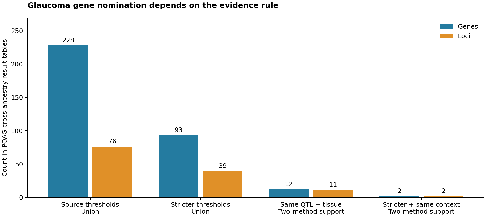
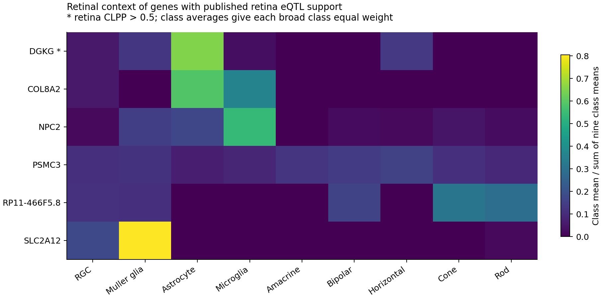

# Glaucoma genetic evidence and retinal cell context

**A completed, AI-assisted secondary-data portfolio pilot.**

Which glaucoma gene nominations remain supported under stricter evidence rules, and what retinal cell context do they show? This project integrates published primary open-angle glaucoma (POAG) GWAS–e/sQTL colocalization results with cluster-average expression from an independent healthy-human retinal single-cell atlas. It demonstrates statistical bioinformatics, transparent evidence handling and reproducible Python analysis.

**[Read the completed report](results/figures_2f57d7230cde6290_attempt2/SUMMARY.md)** · **[Inspect the gene evidence table](results/analysis_173e90345ea951f1/tables/gene_evidence_and_retinal_context.csv)** · **[Inspect source and output checksums](results/analysis_173e90345ea951f1/analysis_manifest.json)**

## Completed findings

| Evidence rule | Supported genes | Supported loci |
|---|---:|---:|
| Source thresholds, either method, after source QC | 228 | 76 |
| Stricter method-specific thresholds (> 0.5), either method | 93 | 39 |
| Two-method support for the same locus, gene, QTL type and tissue | 12 | 11 |
| Stricter thresholds plus same-context two-method support | 2 | 2 |

The baseline count of 228 gene nominations at 76 loci agrees with the original study's summary table. Stricter thresholds change the supported set; excluded genes are not thereby disproven. eCAVIAR CLPP and enloc RCP have different definitions and are not combined as one probability.



Six genes have published retina eQTL support and map to the expression atlas: **COL8A2, DGKG, NPC2, PSMC3, RP11-466F5.8, SLC2A12**. Only DGKG retains retina CLPP > 0.5 in the specified sensitivity. These are candidates for further investigation, not validated therapeutic targets.



The exploratory comparison with 10,000 expression-matched reference gene sets yields **no cell class with BH q < 0.05**. This analysis is small and is not LD-aware GWAS enrichment. CCA processing changes the RGC expression-share ordering despite 5/6 genes retaining their highest-expression broad cell class. Both atlas versions use the same three donors.

## What was analyzed

- Published eCAVIAR and enloc result tables for a cross-ancestry POAG GWAS: Hamel et al. 2024, Supplementary Data 7 and 10. The underlying GWAS studied 34,179 cases and 349,321 controls.
- Published average expression per retinal single-cell cluster: Lukowski et al. 2019, Dataset EV1 and EV2, from 20,009 cells in **three healthy donors**.
- Nine broad retinal cell classes in the primary reference and seven shared classes in the CCA sensitivity.

Full provenance, original authors and download URLs appear in [DATA_SOURCES.md](DATA_SOURCES.md) and [config.json](config.json).

## New work in this pilot

1. Standardized published association records and applied the source QC flag.
2. Separated gene-level nominations from variant-level and tissue-level records; gene IDs are normalized by removing Ensembl version suffixes.
3. Compared source thresholds, stricter thresholds and two-method support within an identical QTL/tissue context.
4. Integrated the evidence with a separate retinal expression dataset by exact gene symbol, leaving unmatched genes visible.
5. Detected **26 non-text/Excel-date gene labels** in each atlas workbook and recorded explicit exclusions without guessed repairs.
6. Computed expression-context summaries, an exploratory expression-matched reference calculation with FDR correction, and CCA-processing sensitivity.
7. Produced four figures, auditable tables, checksum manifests, deterministic resumption and tests for scientific and checkpoint contracts.

The pilot does **not** fit new GWAS, colocalization, MR, raw single-cell or spatial models. Original model results and primary-data collection belong to the cited source authors. The single-cell component uses processed cluster averages; donor-level modeling is future work.

## Reproduce

Requires Python **3.11 or later**. The supplied run used Python 3.12.14. Install dependencies once, then use one entry point:

```bash
python -m pip install -r requirements.txt
python reproduce_all.py
```

The first run downloads three original workbooks from the publisher and checks their SHA-256 values. Subsequent runs verify cached inputs and completed outputs, then reuse compatible results. To prohibit downloads:

```bash
python reproduce_all.py --offline
```

The source workbooks are not stored in Git. An optional offline input-cache archive accompanies the private handover; its three XLSX files belong in `data/raw/`.

Changed inputs, configuration, code or software versions create a different result fingerprint. Existing completed outputs are not overwritten. Interrupted output directories are preserved and a new attempt is used. A changed result file fails validation rather than silently being accepted. Figure-code changes only regenerate figures from saved analysis tables.

After an interrupted process, inspect `results/.pipeline.lock/owner.json` and confirm that the recorded process has stopped before removing the lock directory. Preserve source files and result folders.

## Verify

```bash
python -m unittest discover -s tests -v
```

Nine tests passed locally. They check same-context method agreement, Excel-date exclusions, duplicate-gene rejection, BH adjustment, deterministic reference calculations, valid-cache reuse, interrupted-stage preservation, no-overwrite behavior and explicit figure-only recovery. See [VALIDATION.md](VALIDATION.md). A GitHub Actions workflow is supplied but has not yet been executed on GitHub.

If a figure is damaged, preserve it and rebuild only the reporting stage from validated analysis tables:

```bash
python reproduce_all.py --offline --rebuild-figures
```

## Interpretation and next steps

The result provides an evidence table for choosing follow-up studies. Healthy-retina expression gives cellular context; it does not establish glaucoma differential expression, neuroprotection or a drug effect. No retina enloc records are present in the source table, so method corroboration is not retina-specific validation. Missing entries in thresholded source tables are not fitted zero probabilities.

The exploratory reference does not adjust for LD, gene length, QTL ascertainment or locus-level gene correlation. A nominal cell-class P value is not a validated disease mechanism. The six-gene retina-supported set is too small to support a confident cell-class enrichment claim.

Further work would use full regional GWAS/QTL statistics for allele harmonization and new colocalization, independent disease or injury cohorts, donor-aware single-cell analysis, spatial context, and experimental validation. These steps are proposed extensions, not completed achievements.

## Authorship and assistance

Project owner: **Mila Desi Anasanti**, [ORCID 0000-0002-1321-6295](https://orcid.org/0000-0002-1321-6295). Intended account: `MDAnusamandiriGroup`.

This pilot was prepared with OpenAI Codex assistance for source discovery, workflow design, code generation, execution, tests and documentation. That assistance includes analysis, not only language editing. The owner should review the code and interpretation before relying on it as an independently mastered skill. The repository transparently distinguishes newly computed secondary summaries from original published results. No additional coauthors or institutional endorsements are implied.

Code: MIT license. Original publications and datasets retain their original authorship and terms. [CITATION.cff](CITATION.cff) describes this software; cite the source datasets as well.
