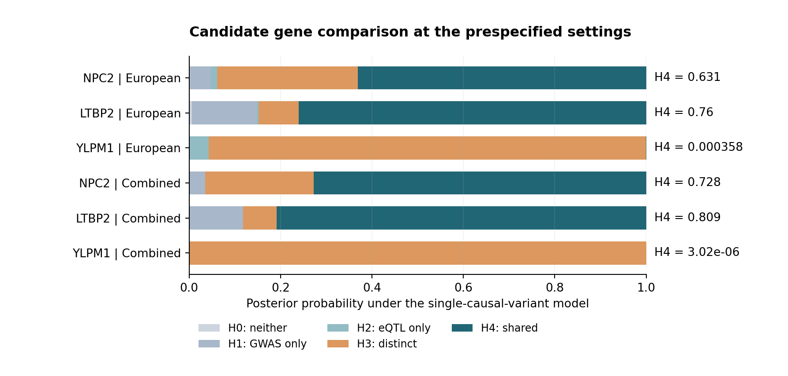
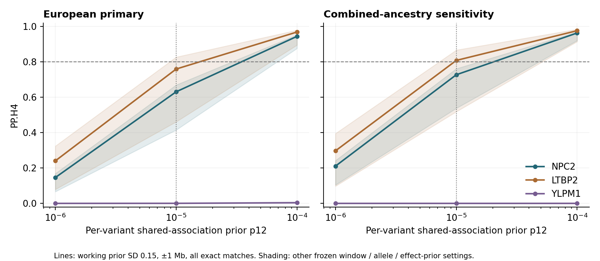

# Targeted glaucoma–retina colocalization

**Completed 6 October 2026.** This module adds a newly fitted genetic analysis to the [glaucoma cell-context pilot](https://github.com/MDAnusamandiriGroup/glaucoma-cell-context). Three prespecified candidate genes were compared using full regional primary open-angle glaucoma (POAG) genome-wide association study (GWAS) and EyeGEx bulk-retina expression quantitative trait locus (eQTL) statistics.

**[Read the completed four-page report](published/report_08eb9809466be5fb/Glaucoma_coloc_pilot_report.pdf)** · **[Inspect the six primary results](published/report_08eb9809466be5fb/Coloc_primary_results.csv)** · **[Download all sensitivity results and QC](published/report_08eb9809466be5fb/Coloc_results_and_QC.xlsx)**

## Computed results

| Gene | European primary PP.H4 | Combined-ancestry PP.H4 | Shared variants, European |
|---|---:|---:|---:|
| NPC2 | 0.631307 | 0.727638 | 4,891 |
| LTBP2 | 0.759979 | 0.808742 | 5,183 |
| YLPM1 | 0.000358 | 0.000003 | 4,764 |



No gene meets the fixed PP.H4 ≥ 0.80 reference in the European primary analysis. LTBP2 exceeds it in the combined-ancestry sensitivity, but none remains above it throughout the frozen sensitivity grid. The combined study contains the European participants and is **not independent replication**. YLPM1 favours distinct associated variants (European PP.H3 = 0.957) under the single-causal-variant model.

PP.H4 measures support for a shared association signal under the model and priors. It is not a probability that a gene is causal. The SNP posterior files and their 95% sets are explicitly **conditional on H4**, and do not provide separate fine-mapping validation.

## What was newly run

- Acquired and checked 17,507 full nominal eQTL rows across three genes, including nonsignificant results. Every gene's row count matches the published cis-variant count.
- Extracted two indexed GWAS regions: GCST90011766 (16,677 cases; 199,580 controls, European) and GCST90011770 (34,179 cases; 349,321 controls, combined ancestry).
- Matched exact GRCh38 chromosome, position and literal allele pairs, aligned swapped effects, retained exact-match indels, and recorded missing variants.
- Fitted six gene–GWAS comparisons and **216 prespecified sensitivity settings**, varying region size, palindromic-variant exclusion, expression-effect prior scale and shared-association prior.
- Verified eight scientific/checkpoint tests, all input/output hashes, posterior normalization and a separate arithmetic reference for the primary fits.

This is an independent **Python implementation** of Wakefield ABFs and the coloc uniform-prior hypothesis equations. The R `coloc` package was not executed, and an empirical R parity comparison has not been performed. **MR and SuSiE-coloc were not run.** These source cohorts were used by earlier published glaucoma nominations; this is a new targeted computation on reused data.

## Methods and material limitations

The plan in [PLAN.json](PLAN.json) was frozen before posterior estimates; it was not externally registered. The primary region is rs754458 ±1 Mb (GRCh38 chr14:74618126), with ±0.5 Mb sensitivity. Primary priors are p1 = p2 = 1e−4 and p12 = 1e−5; p12 is also evaluated at 1e−6 and 1e−4. The GWAS log-odds prior SD is 0.20.

The supplied nominal eQTL file has beta and P, but **no native standard error**. Approximate SE was reconstructed from the rounded published values using `abs(beta) / t.isf(P/2, 404)`, with the published nominal `dof1`, not the optimized permutation `dof2`. The authors applied a normal-quantile transform of log2 CPM for eQTL mapping. Residual expression SD is unavailable: the 0.15 working effect prior is a scale assumption, evaluated also at 0.075 and 0.30. Native GWAS SE was used. No allele frequency was invented.

The strongest source NPC2 eQTL, indel **rs34848569**, is absent at its GRCh38 position in both GWAS extracts and was not substituted with a proxy. Approximately 88–89% of eligible eQTL rows match, but the missing lead variant limits completeness. LTBP2 has weak source gene-level eQTL support (permutation-adjusted P approximately 0.209).

The model assumes at most one causal variant per trait in the region. Bulk-retina eQTL evidence does not establish a microglia or Müller-glia-specific effect. The previous single-cell expression-context results and these genetic results must be interpreted separately. Ancestry-matched LD, multi-signal colocalization, independent QTL data and disease-specific validation are follow-up work.



## Reproduce or inspect

Use **Python 3.12 on Linux** (or Windows Subsystem for Linux) for the POSIX file lock. Exact supplied versions are in [requirements.txt](requirements.txt); the completed checkpoints used Python 3.12.14. From the repository root:

```bash
python -m pip install -r genetics_extension/requirements.txt
python genetics_extension/fetch_sources.py --verify-filtered
python genetics_extension/run_coloc.py
python genetics_extension/validate_results.py
```

The GitHub package includes the four filtered inputs actually used, their source registry and the completed fit/preprocessing checkpoints. **No network access is needed for the fit or validation.** Full chromosome eQTL data and full GWAS files are omitted. In a fresh data-free checkout, `python genetics_extension/fetch_sources.py` acquires the public source data and regional GWAS extracts; source download sizes and exact URLs are recorded in [DATA_SOURCES.md](DATA_SOURCES.md).

The default runner checks input hashes, configuration, code and numerical-library versions. A compatible completed stage is verified and reused. Changed contracts produce a new fingerprint; incomplete or damaged checkpoints are preserved and rejected. The recorded run index is [results/run_index_b5a8e45b71c2f2b4.json](results/run_index_b5a8e45b71c2f2b4.json). If a different environment generates another index, pass that exact path to validation/reporting with `--index`.

```bash
cd genetics_extension
python -m unittest discover -s tests -v
python make_report.py
```

Reporting reads validated fit outputs and never refits. On the tested Python/library versions it reuses its completed report. The [validation notes](VALIDATION.md) distinguish numerical verification from biological validation.

## Ownership, source credit and assistance

Project owner: **Mila Desi Anasanti**, https://orcid.org/0000-0002-1321-6295. This analysis, code, source retrieval, tests and documentation were prepared with **OpenAI Codex assistance**, including analysis assistance. Original data collection and association results belong to the source authors.

Code follows the repository's [MIT license](../LICENSE). The EyeGEx author deposit is CC BY 4.0. Original datasets and publications retain their attribution and terms; see [DATA_SOURCES.md](DATA_SOURCES.md) and [data/method_sources.json](data/method_sources.json).
