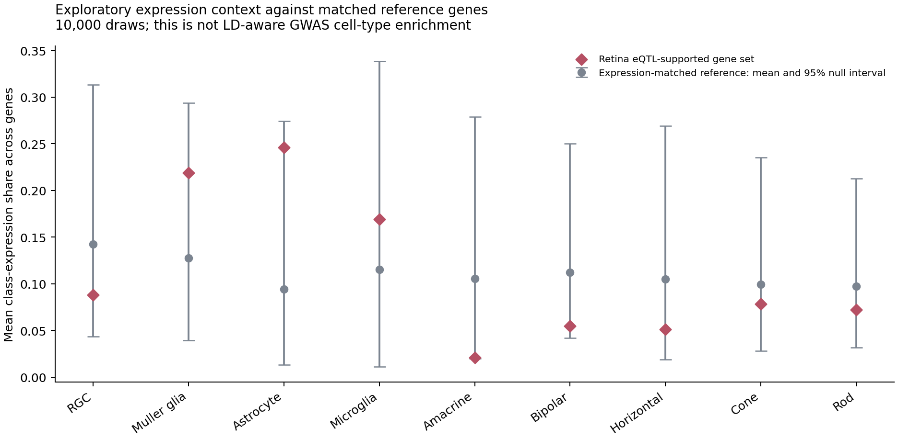
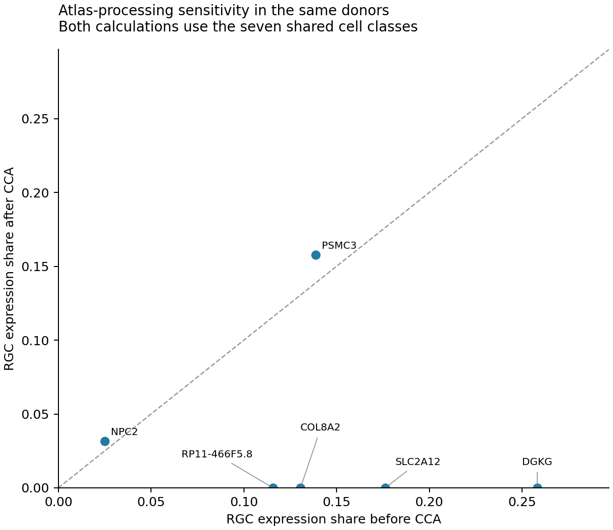

# Glaucoma evidence and retinal cell context: completed pilot

This is a secondary-data analysis of published results, completed on 5 October 2026. It integrates human POAG GWAS–QTL evidence with a separate healthy-human retinal single-cell expression reference. It does not fit a new GWAS, colocalization model, MR model, raw single-cell model, or spatial model.

## Evidence sensitivity

| Evidence rule | Genes | Loci | Locus–gene pairs |
|---|---:|---:|---:|
| baseline union | 228 | 76 | 228 |
| strict union | 93 | 39 | 93 |
| baseline same context agreement | 12 | 11 | 12 |
| strict same context agreement | 2 | 2 | 2 |

The baseline uses the source thresholds (eCAVIAR CLPP > 0.01 or enloc RCP > 0.1) after the source QC filter. The stricter sensitivity uses > 0.5 separately for each method. These scores have different definitions and are not averaged or compared as a common scale. Two-method support requires the same locus, Ensembl gene, QTL type and tissue. It uses overlapping source data, so it is corroboration across methods rather than independent replication.

## Independent expression reference

The reference publication profiled 20,009 cells from **three donors**, not 20,009 independent people. After excluding 26 non-text gene labels, its averages contain 21,963 usable genes. The source XLSX includes gene labels converted by Excel to dates, including ambiguous duplicate dates. We preserve a row-level exclusion audit and do not guess corrected symbols. We collapse 16 annotated clusters into nine broad cell classes using an unweighted mean within each class. This estimates a class-balanced expression profile, not a donor-level pseudobulk profile or a cell-count-weighted population mean. Two unassigned clusters are excluded.

Of the nominated genes, 162 map by exact symbol and 66 do not. Unmatched genes remain in the evidence table. There are 6 gene-ID/symbol entries with retina eQTL support, 1 retaining retina CLPP > 0.5; 6 unique genes map to the atlas for the reference comparison.

There are **no retina enloc rows** in the source result table. Missing retina method evidence is not a negative finding. A strict retina eCAVIAR result plus GTEx method agreement still does not demonstrate retina-specific two-method agreement.

## Exploratory expression-matched reference

We match random control gene sets on deciles of mean retinal expression, exclude candidate genes from the control pool, and sample without replacement within each draw. We compare the mean of class-expression shares using 10,000 draws with a fixed seed. Empirical one-sided P = (1 + number of null means at least as large as observed)/(10,001); BH adjustment covers nine cell classes. The plotted null interval is **not** a confidence interval for a disease effect.

No class crossed BH q < 0.05 in the exploratory matched-reference calculation.

| Cell class | Observed share | Matched reference mean | Empirical P | BH q |
|---|---:|---:|---:|---:|
| Rod | 0.072 | 0.097 | 0.6612 | 0.9639 |
| Cone | 0.078 | 0.100 | 0.5838 | 0.9639 |
| Bipolar | 0.055 | 0.112 | 0.9207 | 0.9730 |
| Amacrine | 0.021 | 0.106 | 0.9730 | 0.9730 |
| Horizontal | 0.051 | 0.105 | 0.7497 | 0.9639 |
| RGC | 0.088 | 0.142 | 0.7450 | 0.9639 |
| Muller glia | 0.219 | 0.128 | 0.1113 | 0.5008 |
| Astrocyte | 0.246 | 0.094 | 0.0408 | 0.3672 |
| Microglia | 0.169 | 0.115 | 0.2798 | 0.8393 |

This reference does not control LD, gene length, QTL ascertainment, or correlation between genes from the same locus. Cell classes are compositional. Treat the calculation as an exploratory context check, not confirmation that glaucoma risk acts in a particular cell class.

## Processing sensitivity

The same publication also provides CCA-adjusted cluster averages. Using the seven classes available in both versions, 5/6 genes retain their highest-expression class; RGC-share Spearman correlation is -0.304. The low-quality CCA10 rod cluster and unassigned CCA3 cluster are excluded according to the source description. Horizontal cells and astrocytes are unavailable after CCA and are omitted from **both** versions for this comparison.

This is a sensitivity analysis within the same three donors, not independent replication. The atlas is healthy tissue; it cannot show glaucoma differential expression or protective response to injury.

## Practical interpretation

The completed result is an auditable evidence table for deciding what to investigate next. Retina regulatory evidence and retinal cell expression provide different information. A nearest gene or a highly expressed gene is not automatically the causal gene. Further work would require allele harmonization, locus-level fine-mapping/colocalization from full summary statistics, donor-aware disease or injury datasets, and experimental validation before proposing a therapeutic direction.

Sources: [Hamel et al. 2024](https://doi.org/10.1038/s41467-023-44380-y), Supplementary Data 7 and 10; [Lukowski et al. 2019](https://doi.org/10.15252/embj.2018100811), Dataset EV1 and EV2. The underlying POAG GWAS is [Gharahkhani et al. 2021](https://doi.org/10.1038/s41467-020-20851-4). All primary-data collection and original model fitting belong to those authors.
