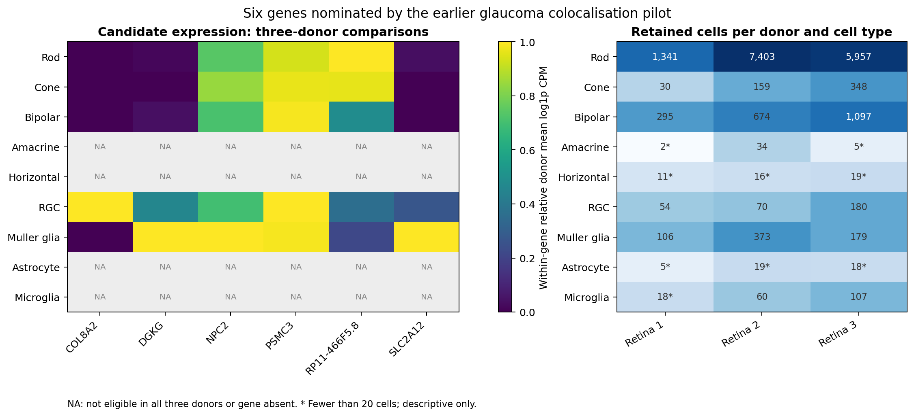

# Count-level retinal single-cell extension

**Completed on 6 October 2026.** A small reproducible technical pilot extending the existing glaucoma genetic-evidence project from published cluster averages to a filtered UMI count matrix.

**[Completed report](published/REPORT.md)** · **[PDF report](published/Glaucoma_Single_Cell_Pilot_Report.pdf)** · **[Donor robustness table](published/tables/robustness_summary.csv)** · **[Validation](VALIDATION.md)**


## Executed analysis

| Item | Completed result |
|---|---|
| Source | Lukowski et al. 2019; published filtered UMI matrix |
| Input | 20,009 cells; 21,989 genes; 3 healthy donors; 5 libraries |
| Primary QC | 19,865 cells retained; >=200 genes, <20% mitochondrial UMIs |
| Strict sensitivity | 14,836 cells retained; >=500 genes, <10% mitochondrial UMIs |
| Feature selection | 2,000 highly variable genes; library-aware selection |
| Embedding and graph | 30 PCs; 15 neighbours; UMAP |
| New Leiden clusters | 14 at resolution 0.5; 15 at resolution 1.0 |
| Candidate analysis | 6 targets; raw-UMI donor/type pseudobulks and equal donor weighting |
| Reproducibility | 5 additional figures; 9 focused tests passed locally; 7 stages reused offline without rewriting outputs |

The six targets were defined by the frozen earlier pilot: COL8A2, DGKG, NPC2, PSMC3, RP11-466F5.8 and SLC2A12. All map exactly to the count matrix. The full 228-gene evidence table is retained with a separate exact-symbol mapping audit.

Primary donor comparisons require >=20 cells in each donor and cell type. Five types meet that rule in all three donors: Rod, Cone, Bipolar, RGC and Muller glia. DGKG, NPC2 and SLC2A12 retain Muller glia as their highest expression context among those five types in all three leave-one-donor-out (LODO) reaggregations. Five of six genes retain their highest context under strict QC; COL8A2 is not evaluable there because no UMIs remain in the eligible comparison types.



Rare-type expression is retained descriptively. A prespecified minimum-10-cell sensitivity admits Horizontal and Microglia and changes some rankings, including NPC2 to Microglia. These results are included rather than hidden. Several targets have sparse counts; rank stability is not evidence of a precisely estimated expression level or a disease mechanism.

## Scope

The analysis starts from the original authors' filtered UMI matrix, not FASTQ files or unfiltered droplets. Published cell labels remain primary. PCA/Leiden/UMAP were fitted anew, with a descriptive canonical-marker audit of clusters. Library-aware gene selection is not batch integration. No new doublet classifier was fitted.

LODO reaggregates existing donor pseudobulks; it does not refit clusters or UMAP. The donor count is three, cells are not independent biological replicates, and there are no disease controls or age-effect estimates. No differential-expression significance tests, new colocalisation, MR, RNA/ATAC integration or spatial mapping are claimed. This is a completed methods portfolio pilot, not a validated glaucoma target study or a peer-reviewed publication.

## Run or resume

Use a separate environment for this module; the earlier pilot's dependency set is unchanged. The executed environment used Python 3.12.14. Exact scientific package versions are pinned.

```bash
python -m venv .venv-singlecell
source .venv-singlecell/bin/activate
python -m pip install -r single_cell/requirements.txt
python single_cell/run_single_cell.py
```

The first run downloads three source files and validates their published MD5 values. A misleading `.csv.gz` filename is handled explicitly: the matrix is inside a gzip-compressed TAR archive and is read incrementally without extracting the 881 MB CSV.

```bash
python single_cell/run_single_cell.py --offline
```

All seven stages have provenance and output checksums. Compatible stages are reused. Partial attempts and changed inputs/parameters/software are kept separately; existing completed outputs are never overwritten. Rendering code is isolated so changes to plots do not refit the analysis. For an explicit new rendering attempt:

```bash
python single_cell/run_single_cell.py --offline --rebuild-report
```

For an interrupted process, inspect `single_cell/results/.pipeline.lock/owner.json` and confirm that the recorded process actually matches this entry point and has stopped before removing the lock. A PID may have been reused by an unrelated process.

## Validate

```bash
cd single_cell
python -m unittest discover -s tests -v
```

The nine new tests use small fixtures; they do not rerun production analysis. See [VALIDATION.md](VALIDATION.md). GitHub CI has not run for this extension.

`published/` is a small frozen results snapshot for inspection. Its provenance files record the full execution, including large outputs not stored on GitHub. It is not a resumable cache. Runtime files belong in `data/raw/` and `results/`, both excluded from the public upload. A private checkpoint archive can restore those complete directories for offline reuse when the software provenance matches.

## Sources and assistance

Lukowski SW et al. (2019), https://doi.org/10.15252/embj.2018100811. Original counts and metadata: https://zenodo.org/records/5515631. Official Scanpy workflow: https://scanpy.readthedocs.io/en/stable/tutorials/basics/clustering.html.

Project owner: Mila Desi Anasanti. This module was prepared with OpenAI Codex assistance for design, code, execution and documentation. Original data collection and published annotations belong to the source authors. Cite the parent pilot and original datasets; their existing authorship and terms remain applicable.
