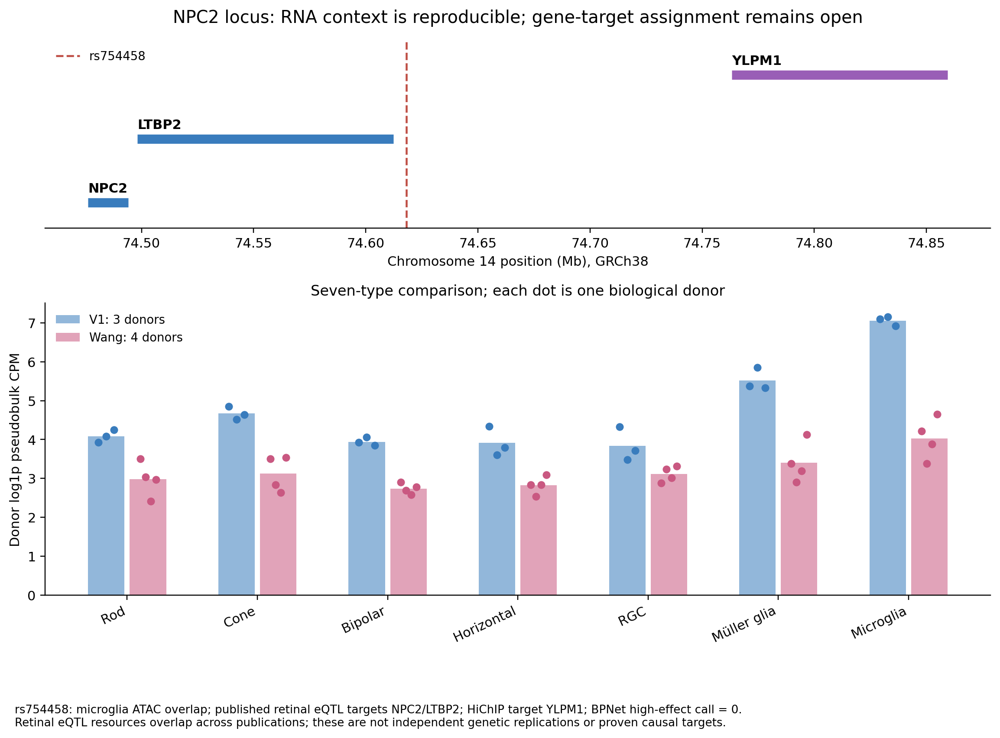

# Glaucoma cell-context V2

**Executed Python analysis: sampling robustness, cross-study retinal RNA, metabolic programs and regulatory triangulation.**

[Read the report](published/REPORT.md) · [PDF](published/Glaucoma_V2_Report.pdf) · [Candidate evidence matrix](published/tables/candidate_evidence_matrix.csv) · [Validation](published/provenance/validation.json)



## Completed findings

| Analysis | Result |
|---|---|
| Published gene nominations | 228 genes at 76 loci |
| Original count-level reference | 19,865 profiles after QC, three healthy donors |
| Independent-study RNA reference | 51,645 nuclear profiles, four donors and eight eyes |
| Exact symbol mapping | 163 genes in V1; 156 in Wang |
| Technical sampling | 2,400 draws across eight frozen scenarios |
| Five-type RNA context concordance | 78 of 139 jointly evaluable genes |
| Seven-type RNA context concordance | 70 of 140 jointly evaluable genes |
| Descriptive context screening rule | 16 genes |
| Predefined metabolic programs | Six; three retain the same relative top type across studies |
| Regulatory evidence | 25 index-variant ATAC overlaps; 14 candidates with published gene links |

NPC2 has stable RNA context across technical draws and studies. Müller glia is highest in the five-type comparison, and microglia is highest when the comparison includes seven types. The rs754458 index variant overlaps a microglia ATAC peak, but published retinal eQTL links name NPC2/LTBP2 while HiChIP points to YLPM1. BPNet does not classify this variant as high effect. This is an unresolved locus mechanism, not a new discovery of NPC2 or a proven causal target.

DGKG changes top context across studies. SLC2A12 agrees across RNA studies but is sparse in V1. PSMC3 is technically unstable despite context concordance. These negative and uncertain results are retained.

## How the analysis works

1. Expand the frozen candidate table to all 228 genes; retain missing symbols explicitly.
2. Sum raw UMIs within donor and published cell type, divide by all-gene UMIs, apply log1p CPM and average donors equally.
3. Use five eligible types for the primary comparison. A separate seven-type sensitivity adds Horizontal and Microglia.
4. Resample within each donor/type without replacement, or thin selected and other UMIs together. Each scenario retains its own fixed comparison set.
5. Analyse a different published RNA study using original labels, four donor identities and exact barcode/count alignment checks.
6. Score six prespecified MSigDB programs with expression-matched controls. Cross-study comparisons reuse identical shared panel/control pairs.
7. Intersect exact index variants with ATAC peaks; keep nearest-gene, co-accessibility, HiChIP, eQTL and existing BPNet evidence separate.

Cell resampling measures technical stability conditional on these samples. Three or four biological donors remain three or four donors, regardless of cell count or resampling repetitions. Healthy whole-cell versus nuclear RNA differences can reflect capture chemistry, donor characteristics and laboratory effects. Program scores are RNA contrasts, not metabolic flux.

Hamel and Wang reuse overlapping retinal eQTL resources; that evidence is not counted as an independent genetic replication. The recent Yuan 2026 cCRE table excludes microglia for low cell numbers. Separate peak/gene matrices were not joined by row order without explicit pairing identifiers. New GWAS, fine-mapping, colocalization, MR or regulatory model training are outside the completed estimates.

## Inspect or reproduce

The results under `published/` are already executed and can be inspected without running Python. That folder is a public report snapshot; it excludes raw RNA and runtime model caches.

For a full rerun, first restore the separately supplied V1 checkpoints or run the V1 module. Install the V2 pinned environment, fetch verified public inputs and run one entry point:

```bash
python -m pip install -r single_cell_v2/requirements.txt
python single_cell_v2/fetch_sources.py
python single_cell_v2/run_v2.py
```

The fixed V1 paths are recorded in `config.json`. Existing validated stages are reused; changed inputs, code or software create new fingerprints. Corrupt outputs are rejected, and failed attempts are preserved. Source acquisition requires about 850 MiB of downloads on a first run. No source RNA matrix belongs in a browser upload to GitHub.

```bash
python -m unittest discover -s single_cell_v2/tests -v
```

Seven scientific/checkpoint contract tests passed locally. The executed data audits, hashes and output manifests appear in `published/provenance/`.

## Authorship and sources

Project owner: **Mila Desi Anasanti**. Implementation and reporting were AI-assisted, with executed outputs and numerical validation supplied for review. The original datasets and published model estimates belong to their cited authors.

- Lukowski et al. 2019: https://doi.org/10.15252/embj.2018100811
- Hamel et al. 2024: https://doi.org/10.1038/s41467-023-44380-y
- Wang et al. 2022: https://doi.org/10.1016/j.xgen.2022.100164
- Yuan et al. 2026: https://doi.org/10.1126/sciadv.adv9162
- MSigDB Hallmark 2025.1.Hs: https://www.gsea-msigdb.org/gsea/msigdb/human/collections.jsp
- MitoCarta3.0: https://www.broadinstitute.org/mitocarta/mitocarta30-inventory-mammalian-mitochondrial-proteins-and-pathways
